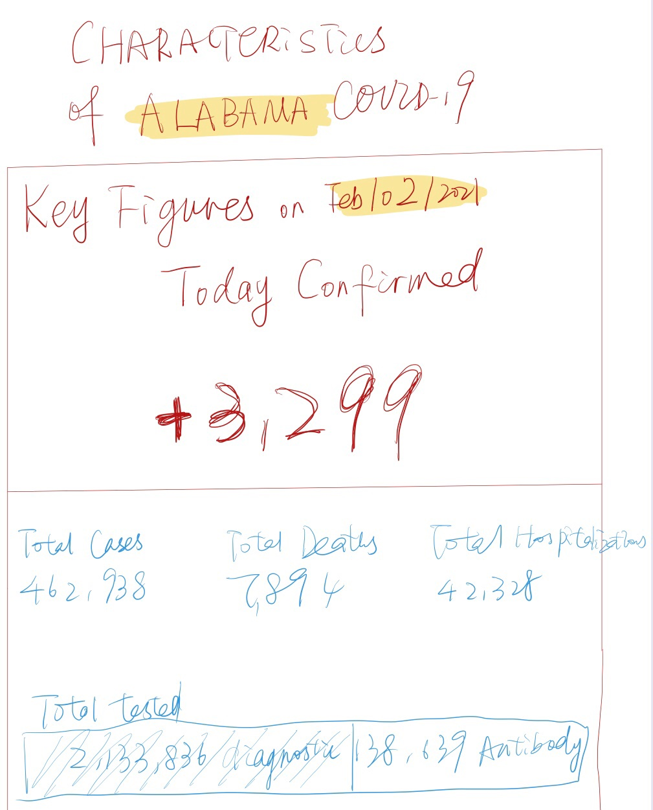

[Back to main page](/Readme.md)

# the Original Data Visualization

My data visualization debut goes here.

Source:
https://www.alabamapublichealth.gov/covid19/assets/cov-al-cases-020221.pdf

# Why Re-vision?

COVID19 is a serious public health problem, arguably the most serious one in recent years faced by all mankind. Now, we have spent a whole year living in the shadow of COVID19 pandemic.
Every local government is trying to track the local cases. The most fundamental way to communicate with people is to release COVID19 cases data. Almost all website we opened have COVID19 data visualizations on it. However, It comes as a great shock to me that some organizations are still struggling to deliver effective information to local people. The most basic numbers are not highlighted clear enough and a simple chart like this can fail in many ways to pass information to people, not even to mention communicate with the people. Scholars, workers and parents, almost all people need those information. But the report has been used to describe data in this format for over a year, still there is no improvement.

# My Re-design Process

Simple chart can be understand more easily, but that does not mean we should take less time to design it. In fact, we should use logic to knit the number together, not just violently put everything on in the same font size and overwhelm people’s eyes.

After adopting Stephen’s method to make a critique on this chart, I immediately detected some failures:

1. Usefulness: The chart is not useful enough for viewers. It has many key informations which is great. But should some information be at the opening of the report? The report is updated on daily basis. But what’s the difference between the today and yesterday? Are we doing better? Are we doing worse? Those questions need to be answered. We cannot let people go to other reports to look it up.

2. Completeness: the visualization is definitely not complete. And I would say that the completeness is the biggest problem among all. Which day is it? The data is for which region? Where is the headline?

3. Aesthetics: it is so hard to read with so many large numbers crowded in small cells. Why there are so many colors? Th3 alignment is a mess.

So I started by adding the most important number on daily report which does not exist here — the change in cases confirmed and highlighted the number also the current case. Then, the data, tested, diagnostic and antibody is not quite the head news here. So those information should be put in smaller fonts. The date, state should be showed on the graph.

The format of the visualization is already clear enough, I don’t want to make it complex since this visualization should pass the information down in capturing people’s attention for less than 10 seconds. I don’t want this to be hard to view.

My initial idea is like this:

According to my user feedback, the bar chart below is distracting and has no significant uses. Audience cannot react with the large number like 452,398, however the +3,299 people will see how serious the problem is. Similarly, 138,639 has no clear meaning for audience, but 0.06 of the total test will tell people that only a very small portion of the tests is antibody.

Those two numbers can pass the urgency of the pandemic to viewers. It is also helpful to add how many current cases there are, not accumulated and how many cases are cured and dead on daily basis. However, I don’t have those data in my hand.  

Here, by a very straightforward data visualization, I would like people to read this chart and immediately get the information that: the cases are still adding severely today. I need the key information, new cases add, to pop out in people’s eye immediately. The alignment before is a mess, and I recreated the alignment system so they are all centered. Also, I adopted a different color schema to let the three part be distinguished to each other with logic. A percentage is highlighted on test rather than the original number. Also, I recreated the title so it could tell the story that the cases is still raising in number. Now the title has the information needed, and it is clear to read.

Since this data viz appears on the top page of the report, simplicity is the best. I adopted the old format here.

# My Final Revision

